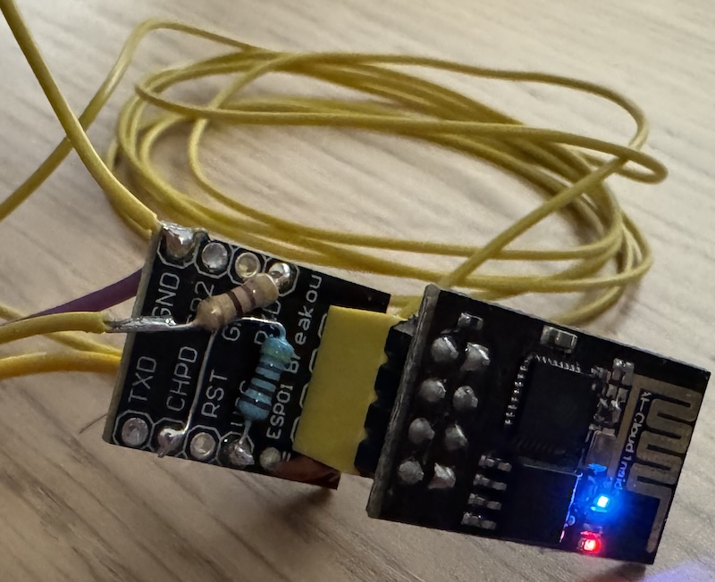

# JiJJY

JiJJY is a *crude* implementation of a [JJY](https://www.nict.go.jp/en/sts/jjy.html) time signal transmitter for the ESP8266 ESP-01 module.

*This project was inspired by [txtempus](https://github.com/hzeller/txtempus), a Raspberry Pi-based transmitter for low frequency time signals from around the world.*


## Lore

On my last trip to Japan I bought a [Seiko DL305K](https://www.seiko-clock.co.jp/product-personal/digital/seiko-series-c3/dl305k.html) digital alarm clock, I got it because it has a cool RGB display *(I'm a simple being: I see blinkenlights, I buy)*.

This clock is "Radio Controlled", meaning that it'll periodically tune in to a low frequency radio signal to receive the current time.

In Japan this signal is provided by a low frequency radio station with callsign [JJY](https://www.nict.go.jp/en/sts/jjy.html), this station transmits a very accurate time signal backed by atomic clocks. JJY is similar to stations like DCF77 (Germany) and WWVB (United States).

JJY has two broadcast sites, one located in east Japan (Ōtakadoyayama transmitter) and one located in west Japan (Haganeyama transmitter). Both transmitters broadcast the same time code but use different frequencies, 40 kHz for east Japan and 60 kHz for west Japan.

Where I live I can't receive JJY, so to sync this clock I have to simulate a JJY signal; after all it would be unacceptable to have a timekeeping device that isn't synchronized down to the millisecond. This is where JiJJY comes in.

JiJJY simulates the Ōtakadoyayama JJY transmitter by *bit banging* a 40 kHz square wave through a loop of wire, this produces a signal that the clock interprets as valid JJY time code.

*40 kHz is (conveniently) the maximum PWM frequency supported by the ESP8266.*

JiJJY sync in action:


*Seiko clocks display a little W or E symbol to show which of the two JJY frequencies is received: West (60 kHz) or East (40 kHz).*


## Antenna wiring

For the antenna, any loop of thin wire will do. Wire the loop between GPIO pin 3 and GND in series with a ±500 Ω resistor, like this:

```
(GPIO 3/RX) -- [±500 Ω] -- ꩜ -- (GND)
```

Place the clock on top of the loop or tape the wire to the back of clock near where the receiving antenna is located, the transmit and receive antennas must be inductively coupled for this to work.

The effective transmission range is tens of millimeters at best (YMMV).



*GPIO 3 (RX) is the only GPIO pin on the ESP-01 board that can be pulled low during startup, pulling any of the other GPIO pins low changes the boot mode of the ESP-01 (check your wiring if both status LEDs are steadily illuminated).*

*Don't forget to pull the CHPD pin to 3.3v to enable the ESP8266.*


## Building

1. Get [Platform IO](https://platformio.org/) and sort out the toolchain for your board and programmer;
1. Rename `include/config.example.h` to `include/config.h` and update the config variables;
1. Build, upload, and 🤞


## Monitoring

During normal operation, the builtin status LED alternates every second (no blink = no good).

JiJJY also broadcasts status messages over the network via UDP:

* `STATUS:ONLINE` - WiFi connected;
* `STATUS:RUN` - Initial time sync succeeded;
* `NTP:SYNC` - System time synced (by default, the system time is synced every hour);
* `NTP:NOSYNC` - System time not synced (last successful NTP sync was > 3 hours ago);
* `TIME:2025-06-08T15:04:00` - Current localtime, sent every minute at `:00` seconds.

Other hosts on the same subnet can listen for these messages by opening a UDP socket on port 1337, for example with nc:
```
nc -klu 1337
```
